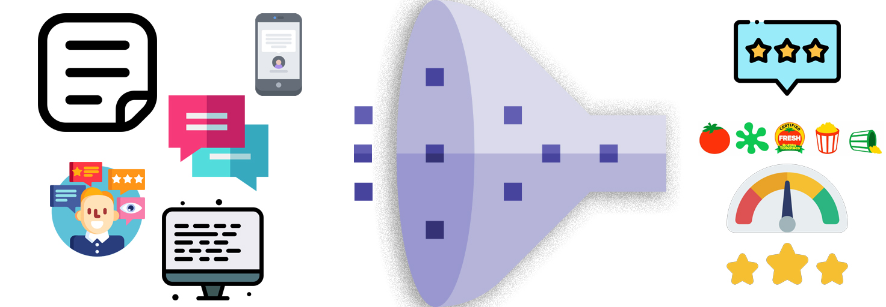

# Transformers
 Transformers have been exciting development in Deep Learning starting with the "Attention is all you need" paper by Ashish Vaswani, et. al. It maximally exploits any set of data where there are correlations between two data points such as sequence models and vision

# Sentiment Analysis on Movie Reviews

## Data:
"There's a thin line between likably old-fashioned and fuddy-duddy, and The Count of Monte Cristo ... never quite settles on either side."
The Rotten Tomatoes movie review dataset is a corpus of movie reviews used for sentiment analysis, originally collected by Pang and Lee. In their work on sentiment treebanks, Socher et al. used Amazon's Mechanical Turk to create fine-grained labels for all parsed phrases in the corpus. This competition presents a chance to benchmark your sentiment-analysis ideas on the Rotten Tomatoes dataset. You are asked to label phrases on a scale of five values: negative, somewhat negative, neutral, somewhat positive, positive. Obstacles like sentence negation, sarcasm, terseness, language ambiguity, and many others make this task very challenging.

## Data reference: 
https://www.kaggle.com/c/sentiment-analysis-on-movie-reviews/
## Attributes :
The dataset is comprised of tab-separated files with phrases from the Rotten Tomatoes dataset. The train/test split has been preserved for the purposes of benchmarking, but the sentences have been shuffled from their original order. Each Sentence has been parsed into many phrases by the Stanford parser. Each phrase has a PhraseId. Each sentence has a SentenceId. Phrases that are repeated (such as short/common words) are only included once in the data.
train.tsv contains the phrases and their associated sentiment labels. We have additionally provided a SentenceId so that you can track which phrases belong to a single sentence.
test.tsv contains just phrases. You must assign a sentiment label to each phrase.
The sentiment labels are:
0 - negative
1 - somewhat negative
2 - neutral
3 - somewhat positive
4 – positive

## Key asks:
•	Assign a sentiment label to each phrase in the test.tsv file

## Model

## Scores:
### Batch of 16

### Batch of 32

Credit for images: 
<a href="https://www.flaticon.com/free-icons/list" title="list icons">List icons created by Freepik - Flaticon</a> 
<a href="https://www.flaticon.com/free-icons/funnel" title="funnel icons">Funnel icons created by Freepik - Flaticon</a> 
<a href="https://www.flaticon.com/free-icons/message" title="message icons">Message icons created by Freepik - Flaticon</a> 
<a href="https://www.flaticon.com/free-icons/feedback" title="feedback icons">Feedback icons created by Freepik - Flaticon</a> 
<a href="https://www.flaticon.com/free-icons/complain" title="complain icons">Complain icons created by Freepik - Flaticon</a> 
<a href="https://www.flaticon.com/free-icons/adaptive" title="adaptive icons">Adaptive icons created by IconMarketPK - Flaticon</a> 
<a href="https://www.flaticon.com/free-icons/smartphone" title="smartphone icons">Smartphone icons created by Nikita Golubev - Flaticon</a> 
<a href="https://www.flaticon.com/free-icons/review" title="review icons">Review icons created by Freepik - Flaticon</a> 
<a href="https://www.flaticon.com/free-icons/customer-experience" title="customer experience icons">Customer experience icons created by juicy_fish - Flaticon</a> 

